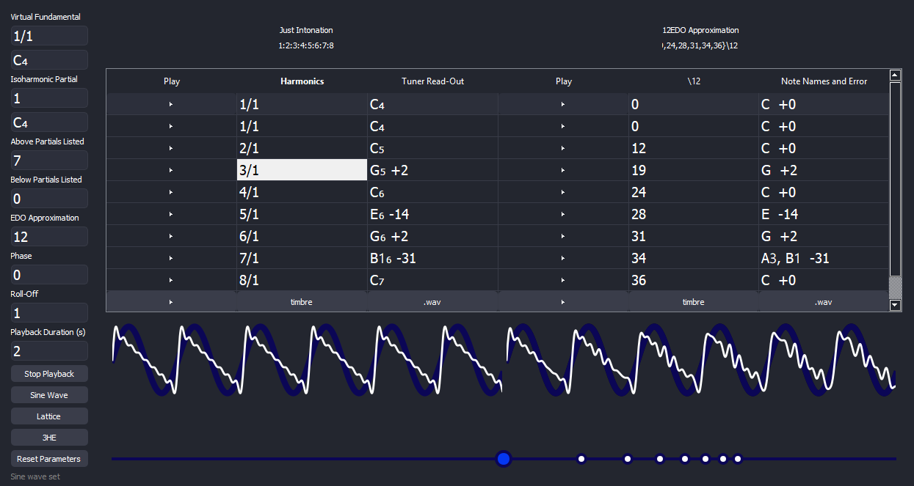

# Isoharmonics
TODO: short description of the project.



## Installation

To install, run:
```bash
pip install requirements.txt
```

To launch the main application, run:
```bash
python main.py
```
